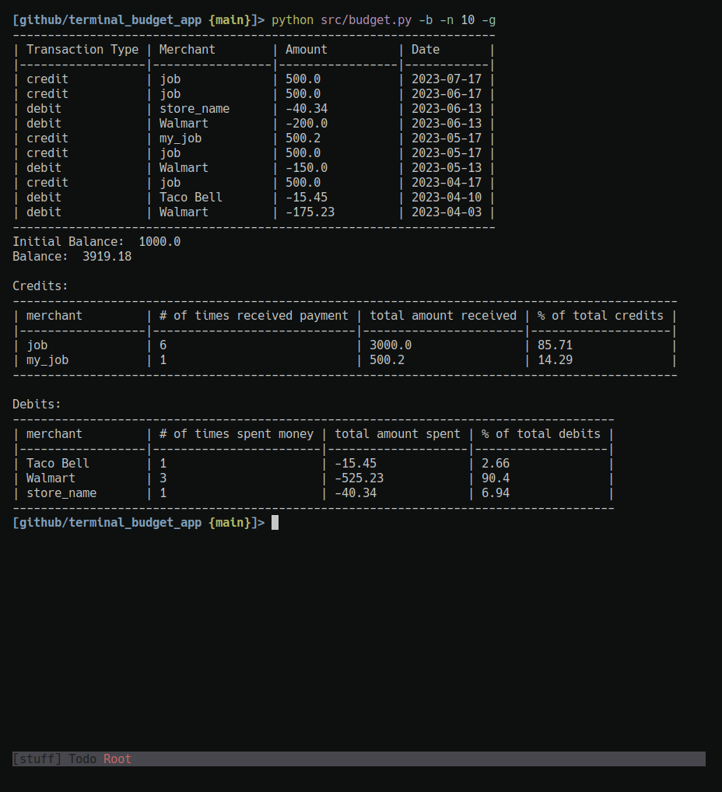

# Terminal Budget App

This is an application that is run from the terminal. It is written in Python 
and accepts arguments to display detailed information about a budget. It reads 
data from a csv and stores the data in a sqlite3 database.

## Getting Started
- Add a csv, or edit account.csv in the files/ (there are examples in account.csv)
- Run Examples:
    - python src/budget.py -h (for help)
    - python src/budget.py -f account.csv (store this csv in the database)
    - python src/budget.py -B 1000 (set the initial balance to 1000)
    - pytho src/budget.py -b -n 10 -g (returns balance, last 10 transactions and extra data)
- make clean (removes __pycache__/)
- make cleandb (resets the database, all data will be lost)

## Example

